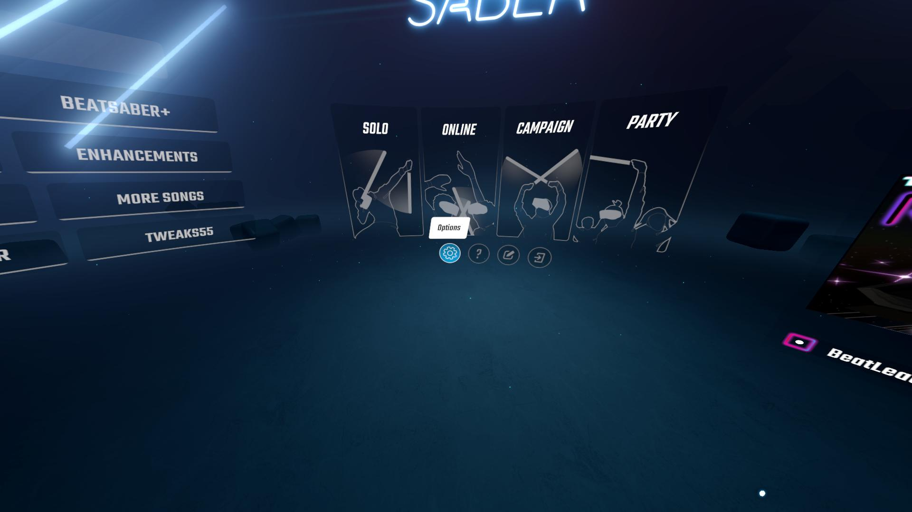
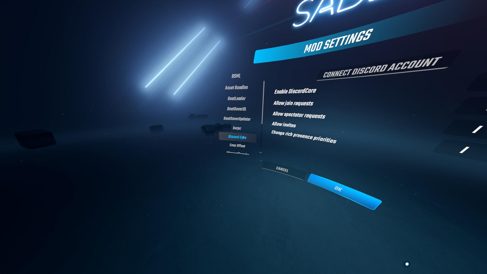

# DiscordCore

A utility mod for easily doing Discord management and handling priority between rich presence systems.

Requires:
 * BSIPA 4
 * [BeatSaberMarkupLanguage](https://github.com/monkeymanboy/BeatSaberMarkupLanguage)
 * DiscordSocialSDK 1.9 (provided in the release zip)

## Usage

### Setting rich presence

```csharp
using Discord;
using DiscordCore;

// In your plugin's Init or OnEnable:
DiscordInstance _discord = DiscordManager.instance.CreateInstance(new DiscordSettings
{
    modId         = "MyMod",
    modName       = "My Mod",
    appId         = 123456789012345678L,  // your Discord application ID
    handleInvites = false,
});

// Update the presence whenever your game state changes:
_discord.UpdateActivity(new Activity
{
    Name    = "Beat Saber",
    Details = "Playing a song",
    State   = "Expert+",
    Timestamps = new ActivityTimestamps
    {
        Start = DateTimeOffset.UtcNow.ToUnixTimeSeconds(),
    },
    Assets = new ActivityAssets
    {
        LargeImage = "cover_art",
        LargeText  = "Song Title",
    },
});

// Clear presence when done (e.g. back in the menu):
_discord.ClearActivity();

// Remove your instance when your plugin unloads:
_discord.DestroyInstance();
```

### Handling join invites

Set `handleInvites = true` in `DiscordSettings` and subscribe to the instance events:

```csharp
DiscordInstance _discord = DiscordManager.instance.CreateInstance(new DiscordSettings
{
    modId         = "MyMod",
    modName       = "My Mod",
    appId         = 123456789012345678L,
    handleInvites = true,
});

_discord.OnActivityJoin += OnJoin;
_discord.OnActivityJoinRequest += OnJoinRequest;
_discord.OnActivityInvite += OnInvite;

private void OnJoin(string secret)
{
    // User accepted a join invite, secret is your join secret string
}

private void OnJoinRequest(ref User user)
{
    // Another user asked to join, user.Id is their Discord user ID
    // (only Id is populated; Username/Avatar are not available via the Social SDK)
}

private void OnInvite(ActivityActionType type, ref User user, ref Activity activity)
{
    // An incoming join invite arrived from user.Id
}
```

Include your join secret in the activity so Discord can send it:

```csharp
_discord.UpdateActivity(new Activity
{
    // ...
    Party = new ActivityParty
    {
        Id   = "lobby-guid",
        Size = new ActivityPartySize { CurrentSize = 1, MaxSize = 5 },
    },
    Secrets = new ActivitySecrets
    {
        Join = "your-join-secret",
    },
});
```

### Priority

When multiple mods have registered instances, the one with the lowest `Priority` value is shown.
Priority is assigned automatically in registration order. You can adjust it via the in-game
DiscordCore settings menu, and the value is persisted in the config.

> **Note for mod developers:** `handleInvites = true` will only fire callbacks once the player has
> connected their Discord account via the in-game settings menu. Rich presence works without it.

---

### Connecting your Discord account (for invite support)

Rich presence works without connecting a Discord account. To enable **invite support** — receiving
join invites from friends — you need to connect your account once from the in-game settings menu.

**Steps:**

1. Launch Beat Saber and open the main menu
2. Navigate to **Options → Mod Settings → Discord Core**

   <a href="./screenshots/options.jpg"></a>

   <a href="./screenshots/mod%20settings.jpg"></a>

   <a href="./screenshots/discordcore.jpg"></a>

3. Click **"Connect Discord account"**

   <a href="./screenshots/connect%20discord.jpg"></a>

4. A Discord authorization dialog will open (either in your browser or the Discord app itself). Review the requested permissions and click **"Authorize"**

   <a href="./screenshots/discord%20popup%201.png"></a> <a href="./screenshots/discord%20popup%202.png"></a>

5. Return to Beat Saber — the button switches to **"Disconnect Discord"**, confirming success

   <a href="./screenshots/disconnect%20discord.jpg"></a>

Your token is saved to `UserData/DiscordCore.json` and refreshed automatically on expiry. You
only need to authorize once per installation. To unlink your account, click **"Disconnect Discord"**
in the same menu.

---

## Breaking changes in v4

v4 migrates from the legacy Discord Game SDK to the Discord Social SDK. If your mod depends on DiscordCore, the following changes affect you.

### `DiscordClient.DefaultAppID` removed

There is no longer a built-in fallback app ID. Every mod must supply an explicit `appId` in
`DiscordSettings`. Passing `0` or a negative value is treated as "no app ID", DiscordCore will
not connect until at least one instance with a valid app ID is registered.

The connection to Discord is now deferred until the first game update tick after all mods have
loaded, so there is no longer an initial connection with a wrong app ID that gets replaced later.

### Invite and join support now requires user authentication

In v3, invite callbacks fired as long as the Discord client was running. In v4, the Social SDK
requires an OAuth2 connection for invite routing — this means **`OnActivityJoin`,
`OnActivityJoinRequest`, and `OnActivityInvite` will only fire if the player has connected their
Discord account** via the in-game DiscordCore settings menu.

Rich presence (activity display) is unaffected and works without authentication.

**What this means for your mod:**

- If a player hasn't connected their account, join invites are silently ignored. Your mod does not
  need to handle this case explicitly — just don't rely on callbacks firing for every user.
- Communicate to players that they need to connect their account in **Settings → Mods → Discord Core**
  before lobby invites will work.
- Design your join flow to degrade gracefully: if a join invite never arrives, the player can still
  join through other means (lobby code, friend list, etc.).

**Advertising join support in your activity:**

Include `Party` and `Secrets.Join` in every activity update while a lobby is open. The Social SDK
will only route the invite if the player is authenticated, but it is safe to include the fields
unconditionally — they are ignored when unauthenticated:

```csharp
_discord.UpdateActivity(new Activity
{
    Details = "In a lobby",
    Party = new ActivityParty
    {
        Id   = myLobby.Id.ToString(),
        Size = new ActivityPartySize { CurrentSize = myLobby.PlayerCount, MaxSize = myLobby.MaxPlayers },
    },
    Secrets = new ActivitySecrets
    {
        Join = myLobby.JoinSecret,   // opaque string your mod uses to route the join
    },
});
```

Clear `Party` and `Secrets` when the lobby closes or the player is back in the menu:

```csharp
_discord.UpdateActivity(new Activity { Details = "In the menu" });
// or just:
_discord.ClearActivity();
```

**Receiving join invites:**

```csharp
_discord.OnActivityJoin += secret =>
{
    // secret is the Secrets.Join string you set above — use it to connect to the lobby
    JoinLobbyBySecret(secret);
};

_discord.OnActivityJoinRequest += (ref User user) =>
{
    // user.Id is the Discord user ID of the requester — only Id is populated
    // (Username, Avatar, etc. are not provided by the Social SDK)
    ShowJoinRequestDialog(user.Id);
};

_discord.OnActivityInvite += (type, ref User user, ref Activity activity) =>
{
    // type is ActivityActionType.Join; user.Id is the inviter's Discord user ID
    AcceptInviteFromUser(user.Id);
};
```

### `User` struct is now Id-only in callbacks

The Social SDK does not provide full user details in invite callbacks. When `OnActivityJoinRequest`
or `OnActivityInvite` fires, only `User.Id` is populated. `Username`, `Discriminator`, `Avatar`,
and `Bot` are always empty/default. Do not display these fields in join request dialogs — use your
own lookup or omit them.

### `ActivitySecrets.Match` and `ActivitySecrets.Spectate` are no longer routed

The Social SDK only routes `Secrets.Join`. Setting `Match` or `Spectate` on an activity has no
effect. The fields still compile (kept for source compatibility), but their values are ignored.

`ActivityActionType.Spectate` and the `OnActivitySpectate` event are also kept as no-op stubs.
The event will never fire.

### Removed types and members

| Removed | Notes |
|---------|-------|
| `DiscordClient.DefaultAppID` | No replacement, each mod must supply its own app ID |

### Unchanged public API

Everything else is backward-compatible. `Discord.Activity`, `Discord.User`, all event delegate
types (`ActivityJoinHandler`, `ActivityInviteHandler`, etc.), `DiscordInstance.UpdateActivity()`,
`DiscordInstance.ClearActivity()`, and all `DiscordInstance` events have the same signatures as
before.

The `Discord.Result`, `Discord.ResultException`, and `Discord.ActivityActionType.Spectate` stubs
are still present for source compatibility, but spectate is not supported by the Social SDK and
the corresponding event will never fire.

---

## Credits

* [@FizzyApple12](https://github.com/FizzyApple12) - original author
* [@qe201020335](https://github.com/qe201020335) - BSMT migration
* [@WentTheFox](https://github.com/WentTheFox) - Maintenance, Discord Social SDK migration

## For developers
### Building DiscordCore
- Download [Discord Social SDK v1.9](https://discord.com/developers/discord-social-sdk/overview) and extract `discord_partner_sdk.dll` (from `bin/release`) into `Refs/Libs/Native`
- Create `DiscordCore/DiscordCore.csproj.user` and add your Beat Saber game path to it

```xml
<?xml version="1.0" encoding="utf-8"?>
<Project>
   <PropertyGroup>
      <!-- Change this path to your Beat Saber install path -->
      <BeatSaberDir>U:/SteamLibrary/steamapps/common/Beat Saber</BeatSaberDir>
   </PropertyGroup>
</Project>
```

- The compiled binaries and all related files will be automatically copied into your game upon build
